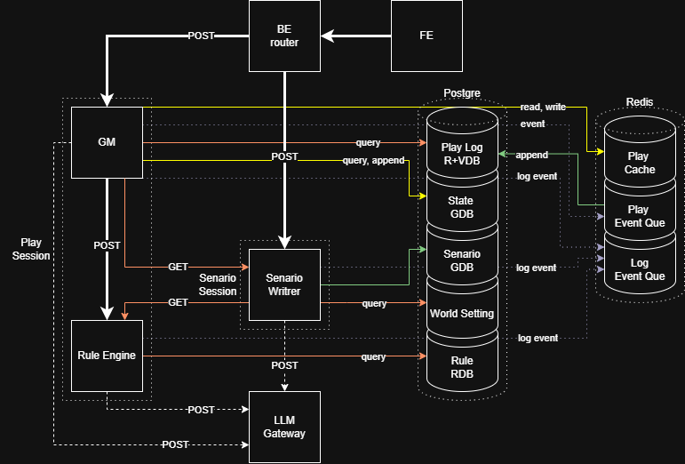

# Plan of GTRPGM

## 방향성

- 룰 준수뿐 아니라 시나리오와 플레이 로그에 부합하는 플레이를 통해 플레이어 몰입 극대화
- 고정된 룰과 세계관 내에서 반 고정된 시나리오를 자유롭게 탐색

### 핵심 기능

- 세계관/구조적으로 일관적인 시나리오 생성
- 자연어로 생성된 시나리오를 분기 및 병합되는 그래프로 변환
- 시나리오 그래프를 기반으로 플레이 상태를 시나리오 그래프에 추가해가며 플레이 진행
- 자연어 발화로 기반으로 룰 선택
- 선택된 룰을 기반으로 상태 업데이트 내용 산출
- 업데이트 된 상태를 자연어로 변환하여 서술
- 전체 플레이가 시나리오에 정합되게 플레이 진행 및 룰 판정 결과 조정

## 아키텍쳐

### 룰 엔진

- 액션으로부터 인스턴스 및 규칙 추출
- DB에서 룰 선택
- 룰 + 인스턴스 기반 상태 변경 결과 산출
- 상태 변경 결과를 GM에 전달
- 시나리오 라이터에서 룰 조회를 위한 인터페이스 제공

### 시나리오 라이터

- 세계관 요약 및 입력값을 기반으로 시나리오 작성
- 시나리오를 그래프 구조로 파싱

### GM

- 플레이어 입력 / GM 입력을 기반으로 룰 엔진 호출
- 룰 엔진 결과를 시나리오 정합성에 맞게 수정
- 상태 변경 적용 및 자연어로 결과 전달
- 상태 요약

### BE Router

- 프런트 요청을 받아 MSA 호출
- MSA 결과를 프런트로 반환

### LLM Gateway

- 공통 LLM 요청 및 응답 관리

## MVP Scope

### MVP (S0)

- [ ] 룰 엔진
  - [ ] 룰 구현을 위한 RDB 설계
  - [ ] 자연어 발화를 기반으로 룰 선택
  - [ ] 선택된 룰을 기반으로 상태 업데이트 내용 산출

- [ ] 시나리오 라이터
  - [ ] 룰 대이터 및 세계관 데이터를 기반으로 일관된 시나리오 생성
  - [ ] 자연어로 생성된 시나리오를 그래프로 변환
  - [ ] 시나리오 상태 전이 조건 정의

- [ ] GM
  - [ ] 플레이어 턴
    - [ ] 주어진 시나리오와 상황에 대해 서술하고 플레이어의 행동을 요구
    - [ ] 룰 엔진에 플레이어 행동 변환 요청
  - [ ] GM 턴
    - [ ] 플레이어 외의 모든 요소에 대해 업데이트
    - [ ] 룰 엔진에 플레이어 외 대상들의 행동 변환 요청 (ex. 고블린의 공격 등)
  - [ ] 공통
    - [ ] 상태 업데이트가 시나리오에 부합하는지 판단 및 조정 (ex. 공격 수치를 줄이기)
    - [ ] 상태 업데이트 적용
    - [ ] 상태 업데이트 결과 산출

- [ ] FE
  - [ ] 선택지 ui 없이 채팅 기반 TRPG 진행
  - [ ] 기본 채팅 요소 - 입력, 히스토리, 세션 관리
  - [ ] 세계 상태 요약 - 시퀀스 내 캐릭터, 장비 등

### S1

- [ ] 품질 개선
  - [ ] 멀티 에이전트
  - [ ] 프롬프트 튜닝 및 엔지니어링
  - [ ] 컨텍스트 관리 개선(캐싱 등)
  - [ ] SLM 도입 검토
  - [ ] 파이프라인 정리 및 최적화

- [ ] FE
  - [ ] 멀티 세션 및 유저 관리
  - [ ] 로그인 ui

- [ ] BE
  - [ ] 멀티 유저 도입
  - [ ] 로그인 및 세션 관리
  - [ ] 옵저빌리티 확보 및 개선

### S2

- [ ] 지표 개선
  - [ ] 베이스라인 측정
  - [ ] 레이턴시 및 토큰 사용량 개선

- [ ] 추가 기능
  - [ ] 룰북 및 세계관 추가

- [ ] BE
  - [ ] 동시 접속 및 트래픽 테스트
  - [ ] 배치 처리 및 요청
  - [ ] 스케일 아웃 테스트

- [ ] FE
  - [ ] 디자인 개선
  - [ ] 시나리오 편집 ui
